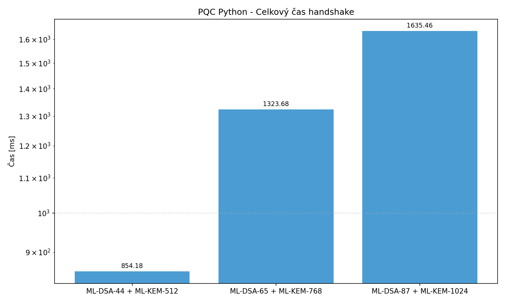
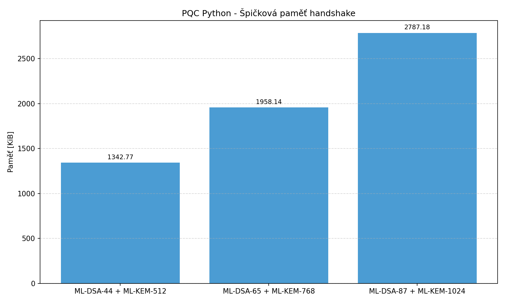
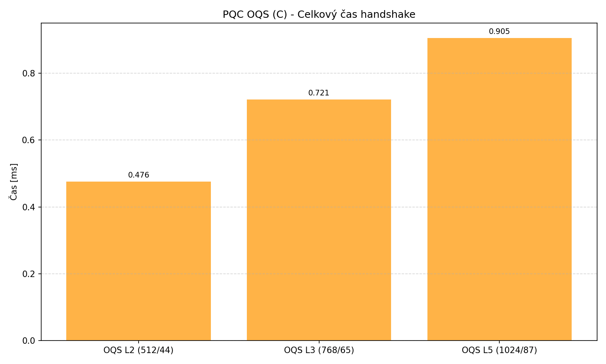
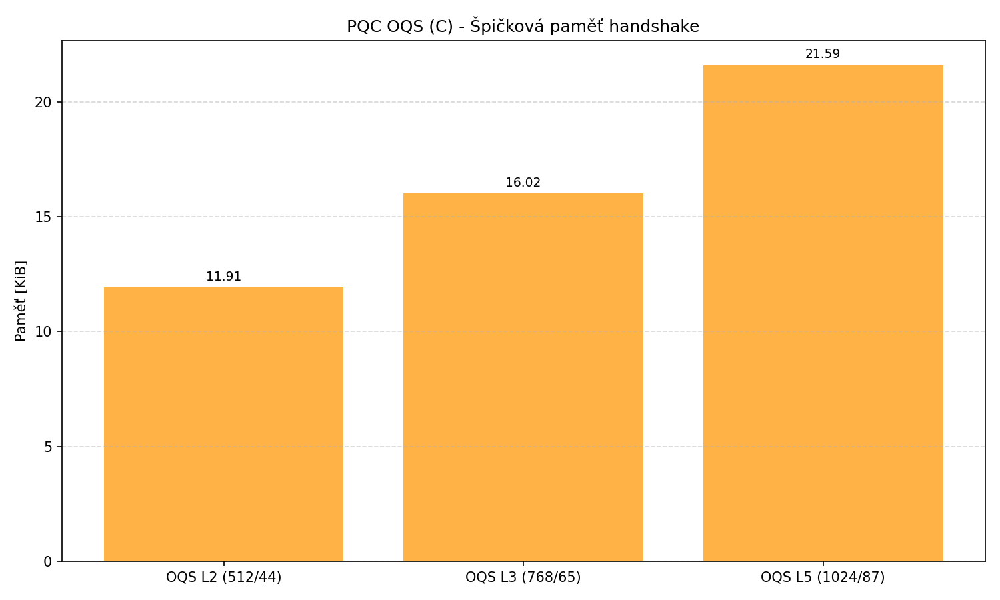
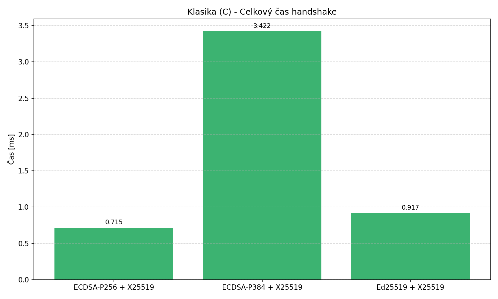
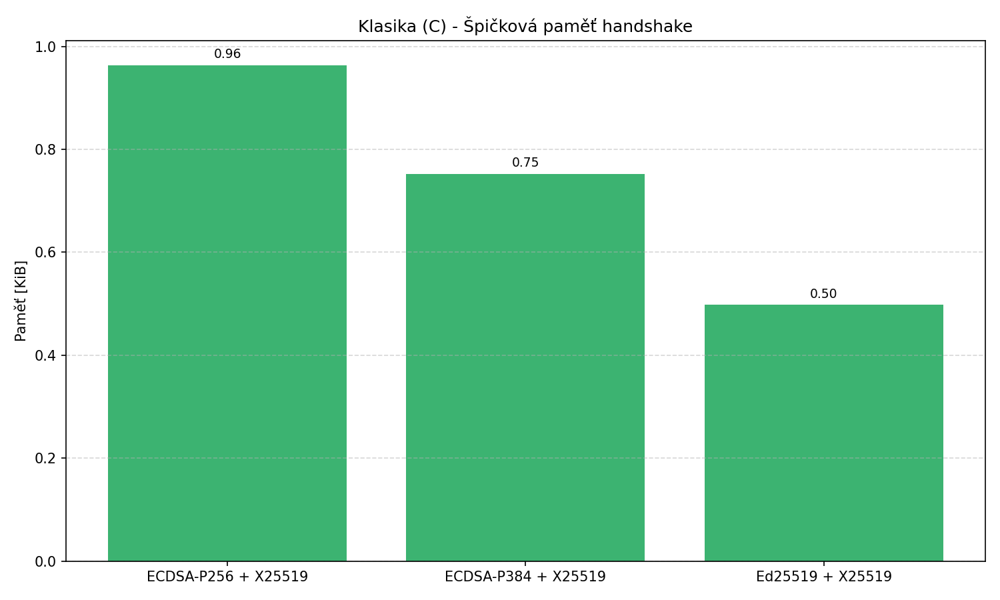

# Porovnání výkonu post-kvantové a klasické kryptografie v TLS handshake

Tento repozitář obsahuje semestrální projekt do předmětu **AP7AK (Aplikovaná kryptografie)**.

## 🎯 Cíl projektu

Hlavním cílem práce je analýza a výkonnostní srovnání post-kvantových kryptografických algoritmů (PQC) implementovaných "from scratch" v čistém Pythonu oproti optimalizovaným C knihovnám, a jejich následné srovnání s klasickou kryptografií v kontextu simulovaného TLS 1.3 handshake protokolu.

Projekt se zaměřuje na dvě hlavní sady algoritmů standardizovaných NIST:
* **ML-KEM (Kyber):** Mechanismus pro zapouzdření klíče (Key Encapsulation Mechanism).
* **ML-DSA (Dilithium):** Schéma digitálního podpisu.

---

## 📊 Část 1: Benchmark kryptografických primitiv (Python vs. OQS)

V této sekci porovnáváme rychlost samotných operací (generování klíčů, šifrování/podpis, dešifrování/ověření) mezi mou vlastní implementací v Pythonu a optimalizovanou C knihovnou `liboqs`.

> **Poznámka:** Kvůli propastnému rozdílu v rychlosti (interpretovaný jazyk vs. kompilované C) využívají grafy **logaritmickou osu**.

### ML-KEM (Key Encapsulation)

Výsledky ukazují, že C implementace je v průměru **400x až 600x rychlejší** než čistý Python.

| Varianta | Operace | Python [ms] | OQS (C) [ms] | Zrychlení (x) |
| :--- | :--- | :--- | :--- | :--- |
| **ML-KEM-512** | KeyGen | 3.930 | 0.0166 | **237.0x** |
| | Encaps | 6.033 | 0.0105 | **577.0x** |
| | Decaps | 6.891 | 0.0113 | **607.6x** |
| **ML-KEM-768** | KeyGen | 6.220 | 0.0152 | **408.4x** |
| | Encaps | 9.261 | 0.0152 | **607.3x** |
| | Decaps | 10.370 | 0.0170 | **609.6x** |
| **ML-KEM-1024** | KeyGen | 9.216 | 0.0215 | **428.1x** |
| | Encaps | 13.263 | 0.0223 | **595.5x** |
| | Decaps | 14.761 | 0.0251 | **588.0x** |

#### Grafy operací ML-KEM
| Generování klíčů | Zapouzdření (Encaps) | Rozbalení (Decaps) |
| :---: | :---: | :---: |
|  |  |  |

### ML-DSA (Digital Signature)

U digitálních podpisů je moje implementace přibližně **200x až 230x pomalejší** než OQS. Operace `Sign` je výpočetně nejnáročnější.

| Varianta | Operace | Python [ms] | OQS (C) [ms] | Zrychlení (x) |
| :--- | :--- | :--- | :--- | :--- |
| **ML-DSA-44** | KeyGen | 11.445 | 0.0494 | **231.5x** |
| | Sign | 45.241 | 0.2066 | **219.0x** |
| | Verify | 11.983 | 0.0530 | **226.2x** |
| **ML-DSA-65** | KeyGen | 19.269 | 0.0955 | **201.7x** |
| | Sign | 80.748 | 0.3545 | **227.8x** |
| | Verify | 18.404 | 0.0860 | **214.0x** |
| **ML-DSA-87** | KeyGen | 27.970 | 0.1338 | **209.0x** |
| | Sign | 101.518 | 0.4379 | **231.8x** |
| | Verify | 28.634 | 0.1388 | **206.3x** |

#### Grafy operací ML-DSA
| Generování klíčů | Podpis (Sign) | Ověření (Verify) |
| :---: | :---: | :---: |
|  |  |  |

---

## 🚀 Část 2: Simulace TLS Handshake

Tato část simuluje zjednodušený průběh TLS 1.3 handshake (výměna klíčů + autentizace serveru) a měří celkový čas a paměťovou náročnost pro jednotlivé kroky protokolu.

### 1. Moje implementace (Pure Python)
Zde se ukazuje daň za použití čistého Pythonu pro komplexní matematické operace nad mřížkami. Handshake trvá v řádu sekund.

| Varianta | Průměrný čas [ms] | Paměť [KiB] |
| :--- | :--- | :--- |
| **ML-DSA-44 + ML-KEM-512** | 854.18 | 1342.77 |
| **ML-DSA-65 + ML-KEM-768** | 1323.68 | 1958.14 |
| **ML-DSA-87 + ML-KEM-1024** | 1635.46 | 2787.18 |

| Grafy PQC Python |
| :---: |
|  |
|  |

### 2. Open Quantum Safe (OQS - C Library)
Výkonnost handshake při použití optimalizované knihovny `liboqs` ukazuje, že **PQC je připraveno pro praxi**. Časy jsou pod 1 milisekundu.

| Varianta | Průměrný čas [ms] | Paměť [KiB] |
| :--- | :--- | :--- |
| **OQS L2 (512/44)** | 0.476 | 11.91 |
| **OQS L3 (768/65)** | 0.721 | 16.02 |
| **OQS L5 (1024/87)** | 0.905 | 21.59 |

#### Detailní rozpad časů (OQS implementace)

| Grafy PQC OQS (C) |
| :---: |
|  |
|  |

### 3. Klasická kryptografie (Reference)
Srovnání s dnešními standardy (ECDH X25519 + ECDSA/Ed25519). Zajímavým zjištěním je, že **optimalizované PQC (OQS) dosahuje srovnatelných nebo lepších výsledků** než klasické eliptické křivky, zejména u vyšších stupňů bezpečnosti (ECDSA-P384).

| Varianta | Průměrný čas [ms] | Paměť [KiB] |
| :--- | :--- | :--- |
| **ECDSA-P256 + X25519** | 0.715 | 0.96 |
| **ECDSA-P384 + X25519** | 3.422 | 0.75 |
| **Ed25519 + X25519** | 0.917 | 0.50 |

| Grafy Klasická kryptografie (C) |
| :---: |
|  |
|  |

---

Filip Hajduch