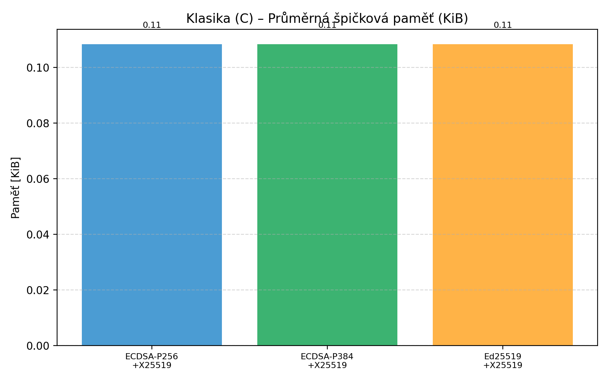
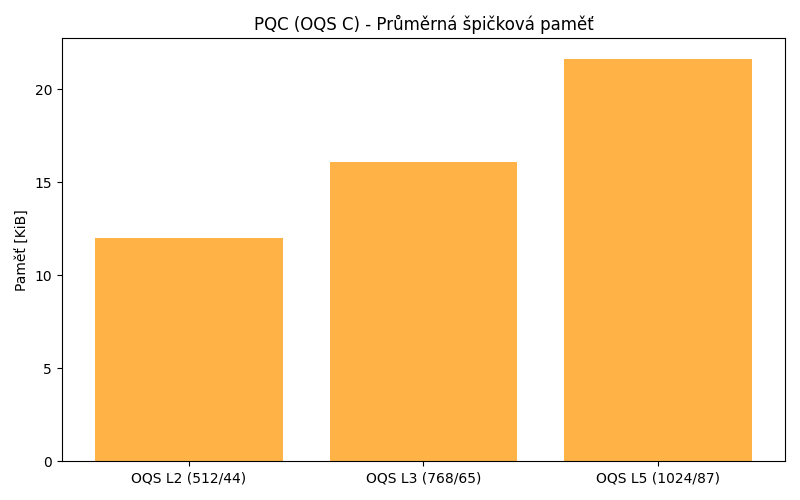
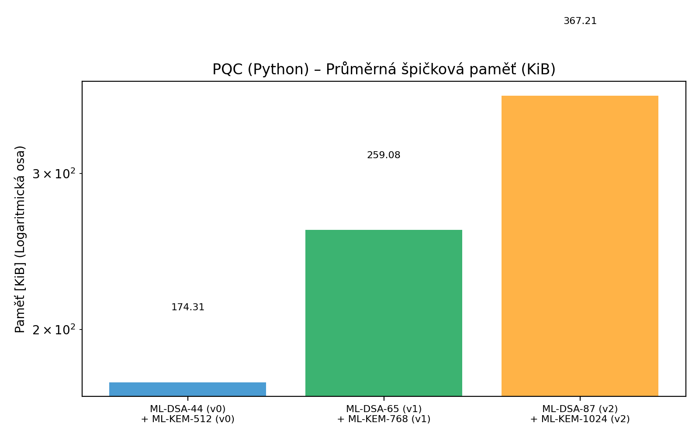

# Performance Analysis of Classical vs. Post-Quantum Cryptography in a TLS-like Handshake

This project provides a performance comparison between classical and post-quantum cryptographic (PQC) algorithms within a simulated TLS 1.3 handshake. The main goal is to measure and compare the performance in terms of execution time and memory consumption.

This work was created as a semester project for the course **AP7AK** (Applied Cryptology).

The motivation for this analysis stems from the ongoing standardization process led by the National Institute of Standards and Technology (NIST) to select and standardize PQC algorithms that can resist attacks from future quantum computers. This benchmark aims to provide practical insights into the real-world performance implications of migrating from classical to post-quantum cryptography.

Three different implementations are benchmarked:
1.  **Pure Python PQC**: A from-scratch implementation of ML-DSA and ML-KEM in Python, following the FIPS 203 and FIPS 204 standards.
2.  **PQC with OQS (C Library)**: A Python wrapper that utilizes the `liboqs` C library for high-performance PQC operations.
3.  **Classical Cryptography (C Library)**: A Python wrapper using the `cryptography` library (which internally uses OpenSSL) for classical algorithms like ECDSA and ECDH.

The benchmark measures the performance of different security levels for each implementation.


## Project Structure

```
.
├── main.py                 # Main script to run all benchmarks
├── graphs/                 # Directory for generated performance graphs
├── tls/
│   ├── tls.py              # Pure Python implementation of PQC handshake
│   ├── tls_oqs_pqc_c.py    # Wrapper for OQS C library
│   ├── tls_classic_c.py    # Wrapper for classical C library
│   ├── mldsa.py            # Pure Python ML-DSA implementation
│   ├── mlkem.py            # Pure Python ML-KEM implementation
│   ├── mldsa_files/        # Helper modules for ML-DSA
│   └── mlkem_files/        # Helper modules for ML-KEM
└── test/
    ├── test_tls.py         # Main benchmark script
    └── test_utils.py       # Utility functions for testing
```

## Performance Results

The following tables and graphs show the results of the benchmarks, comparing average handshake time and peak memory usage across the different implementations and security levels.

### Summary Tables

**Average Handshake Time (ms)**

| Varianta                             | Total [ms] | 1_KeyGen [ms] | 3_Srv_KEM+Sign [ms] | 4_Clnt_Verify+Enc [ms] | 5_Srv_Decaps [ms] |
|--------------------------------------|------------|---------------|---------------------|------------------------|-------------------|
| ML-DSA v0 + ML-KEM v0 (Python)       | 735.358    | 59.695        | 435.008             | 163.456                | 77.091            |
| ML-DSA v1 + ML-KEM v1 (Python)       | 1190.531   | 92.854        | 734.122             | 247.579                | 115.881           |
| ML-DSA v2 + ML-KEM v2 (Python)       | 1625.920   | 138.062       | 951.930             | 362.060                | 173.764           |
| ML-DSA-44 + ML-KEM-512 (OQS-C)       | 0.636      | 0.202         | 0.261               | 0.130                  | 0.018             |
| ML-DSA-65 + ML-KEM-768 (OQS-C)       | 0.754      | 0.136         | 0.405               | 0.168                  | 0.023             |
| ML-DSA-87 + ML-KEM-1024 (OQS-C)      | 0.926      | 0.161         | 0.481               | 0.231                  | 0.031             |
| ECDSA-P256 + ECDHE-X25519 (Crypto-C) | 0.854      | 0.125         | 0.177               | 0.368                  | 0.165             |
| ECDSA-P384 + ECDHE-X25519 (Crypto-C) | 3.773      | 0.651         | 0.908               | 2.018                  | 0.171             |
| Ed25519 + ECDHE-X25519 (Crypto-C)    | 0.947      | 0.100         | 0.193               | 0.474                  | 0.165             |

**Average Peak Memory (KiB)**

| Varianta                             | Total [KiB] | 1_KeyGen [KiB] | 3_Srv_KEM+Sign [KiB] | 4_Clnt_Verify+Enc [KiB] | 5_Srv_Decaps [KiB] |
|--------------------------------------|-------------|----------------|----------------------|-------------------------|--------------------|
| ML-DSA v0 + ML-KEM v0 (Python)       | 174.31      | 451.99         | 1200.70              | 722.22                  | 174.31             |
| ML-DSA v1 + ML-KEM v1 (Python)       | 259.08      | 704.84         | 1755.42              | 1095.19                 | 259.08             |
| ML-DSA v2 + ML-KEM v2 (Python)       | 367.21      | 1092.95        | 2494.40              | 1615.21                 | 367.21             |
| ML-DSA-44 + ML-KEM-512 (OQS-C)       | 1.30        | 6.48           | 10.72                | 7.42                    | 1.30               |
| ML-DSA-65 + ML-KEM-768 (OQS-C)       | 1.61        | 9.14           | 14.27                | 9.62                    | 1.61               |
| ML-DSA-87 + ML-KEM-1024 (OQS-C)      | 2.08        | 11.22          | 18.78                | 12.27                   | 2.08               |
| ECDSA-P256 + ECDHE-X25519 (Crypto-C) | 0.11        | 0.18           | 0.44                 | 0.43                    | 0.09               |
| ECDSA-P384 + ECDHE-X25519 (Crypto-C) | 0.11        | 0.20           | 0.47                 | 0.41                    | 0.09               |
| Ed25519 + ECDHE-X25519 (Crypto-C)    | 0.11        | 0.11           | 0.30                 | 0.29                    | 0.09               |

### Result Graphs

### Classical Algorithms (via C Library)

**Average Handshake Time**


**Average Peak Memory**



### Post-Quantum Algorithms (via OQS C Library)

**Average Handshake Time**


**Average Peak Memory**


### Post-Quantum Algorithms (Pure Python)

**Average Handshake Time**
*(Note: Logarithmic scale)*


**Average Peak Memory**
*(Note: Logarithmic scale)*


## Conclusion

The benchmark results clearly demonstrate the performance trade-offs between different cryptographic implementations.

-   **Pure Python PQC vs. C-based Implementations**: The pure Python implementation of ML-DSA and ML-KEM is significantly slower (by several orders of magnitude) and consumes much more memory compared to the C-based implementations (OQS and classical). This highlights the critical role of low-level, optimized code for cryptographic operations.

-   **PQC (OQS) vs. Classical (Crypto)**: The OQS-based post-quantum algorithms show performance that is highly competitive with classical algorithms. For instance, the handshake time for `ML-DSA-44 + ML-KEM-512` is even faster than for `ECDSA-P256`. This suggests that the transition to PQC does not necessarily have to come with a major performance penalty, especially when using optimized libraries.

-   **Performance within Categories**:
    -   Among the classical algorithms, `ECDSA-P384` is noticeably slower than `ECDSA-P256` and `Ed25519`.
    -   For the PQC algorithms, performance degrades gracefully as the security level increases, but the overall times remain well under a few milliseconds.
    -   The memory footprint of PQC algorithms is generally larger than their classical counterparts, but it remains within a very reasonable range (a few KiB) for the C-based implementations.

In summary, while a naive Python implementation is useful for educational purposes, for any practical application, an optimized C library like `liboqs` is essential. The results are promising, indicating that post-quantum cryptography is ready for real-world deployment without prohibitive performance costs.

## Author

**Filip Hajduch**