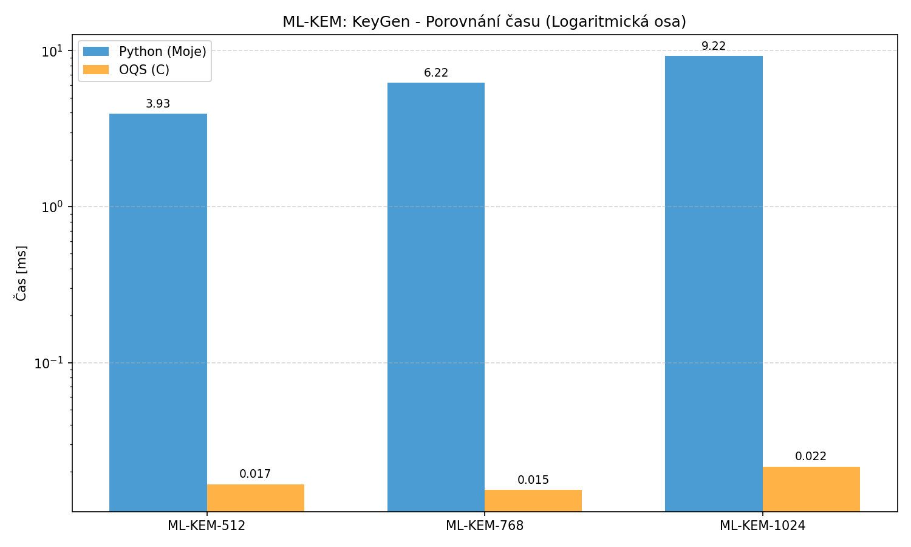
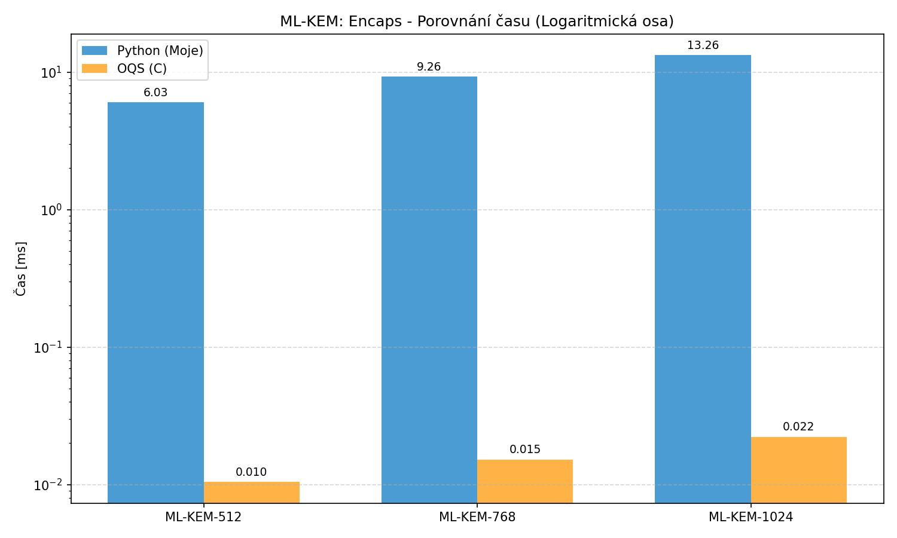
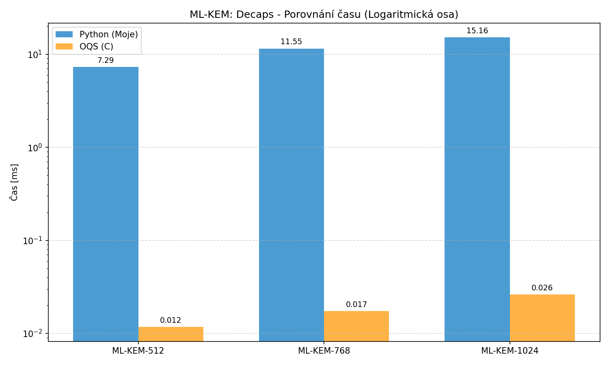
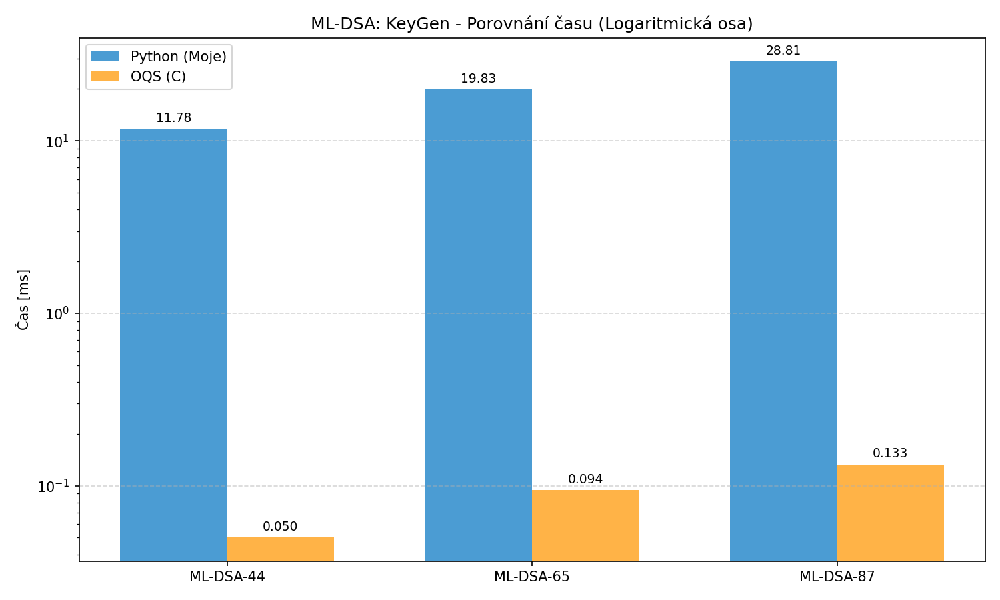
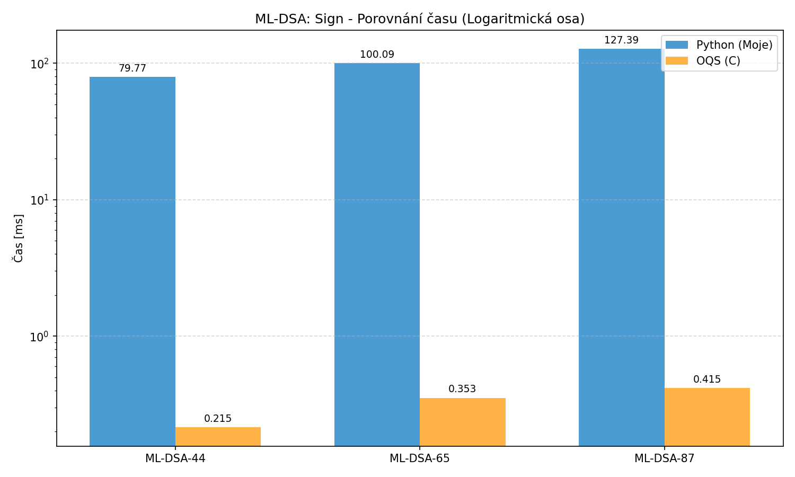
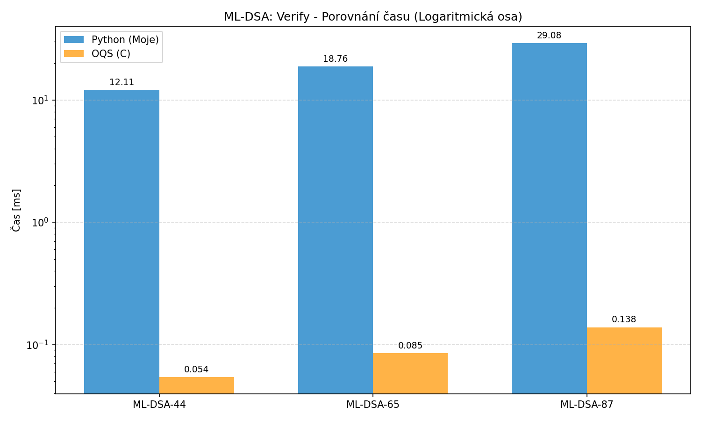
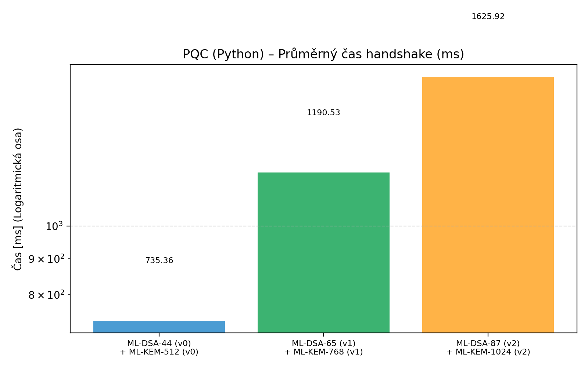
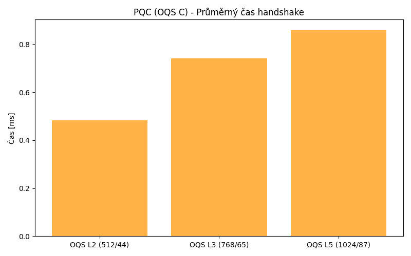
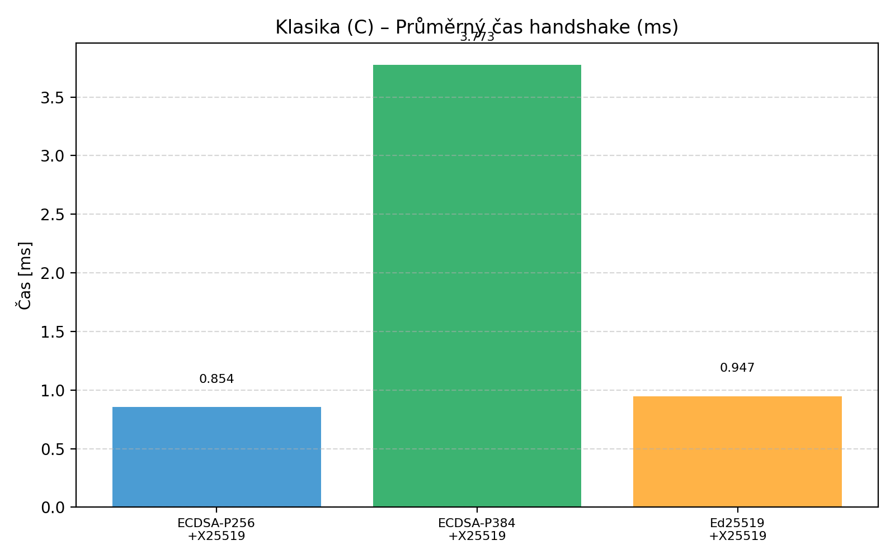

# Porovnání výkonu post-kvantové a klasické kryptografie v TLS handshake

Tento repozitář obsahuje semestrální projekt do předmětu **AP7AK (Aplikovaná kryptografie)**.

## 🎯 Cíl projektu

Hlavním cílem práce je analýza a výkonnostní srovnání post-kvantových kryptografických algoritmů (PQC) implementovaných "from scratch" v čistém Pythonu oproti optimalizovaným C knihovnám, a jejich následné srovnání s klasickou kryptografií v kontextu simulovaného TLS 1.3 handshake protokolu.

Projekt se zaměřuje na dvě hlavní sady algoritmů standardizovaných NIST:
* **ML-KEM (Kyber):** Mechanismus pro zapouzdření klíče (Key Encapsulation Mechanism).
* **ML-DSA (Dilithium):** Schéma digitálního podpisu.

---

## 📊 Část 1: Benchmark kryptografických primitiv (Python vs. OQS)

V této sekci porovnáváme rychlost samotných operací (generování klíčů, šifrování/podpis, dešifrování/ověření) mezi mou vlastní implementací v Pythonu a optimalizovanou C knihovnou `liboqs`.

> **Poznámka:** Kvůli propastnému rozdílu v rychlosti (interpretovaný jazyk vs. kompilované C) využívají grafy **logaritmickou osu**.

### ML-KEM (Key Encapsulation)

Výsledky ukazují, že C implementace je v průměru **400x až 600x rychlejší** než čistý Python.

| Varianta | Operace | Python [ms] | OQS (C) [ms] | Zrychlení (x) |
| :--- | :--- | :--- | :--- | :--- |
| **ML-KEM-512** | KeyGen | 4.319 | 0.0172 | **251.7x** |
| | Encaps | 6.336 | 0.0108 | **585.6x** |
| | Decaps | 7.286 | 0.0117 | **621.3x** |
| **ML-KEM-768** | KeyGen | 6.432 | 0.0158 | **406.1x** |
| | Encaps | 9.523 | 0.0159 | **597.5x** |
| | Decaps | 11.547 | 0.0174 | **663.8x** |
| **ML-KEM-1024** | KeyGen | 9.521 | 0.0222 | **429.4x** |
| | Encaps | 13.533 | 0.0230 | **587.6x** |
| | Decaps | 15.156 | 0.0261 | **580.3x** |

#### Grafy operací ML-KEM
| Generování klíčů | Zapouzdření (Encaps) | Rozbalení (Decaps) |
| :---: | :---: | :---: |
|  |  |  |

### ML-DSA (Digital Signature)

U digitálních podpisů je moje implementace přibližně **200x až 300x pomalejší** než OQS. Operace `Sign` je výpočetně nejnáročnější.

| Varianta | Operace | Python [ms] | OQS (C) [ms] | Zrychlení (x) |
| :--- | :--- | :--- | :--- | :--- |
| **ML-DSA-44** | KeyGen | 11.778 | 0.0501 | **235.1x** |
| | Sign | 79.770 | 0.2147 | **371.5x** |
| | Verify | 12.108 | 0.0541 | **223.7x** |
| **ML-DSA-65** | KeyGen | 19.833 | 0.0943 | **210.4x** |
| | Sign | 100.088 | 0.3530 | **283.5x** |
| | Verify | 18.765 | 0.0850 | **220.8x** |
| **ML-DSA-87** | KeyGen | 28.809 | 0.1329 | **216.7x** |
| | Sign | 127.390 | 0.4155 | **306.6x** |
| | Verify | 29.077 | 0.1383 | **210.3x** |

#### Grafy operací ML-DSA
| Generování klíčů | Podpis (Sign) | Ověření (Verify) |
| :---: | :---: | :---: |
|  |  |  |

---

## 🚀 Část 2: Simulace TLS Handshake

Tato část simuluje zjednodušený průběh TLS 1.3 handshake (výměna klíčů + autentizace serveru) a měří celkový čas a paměťovou náročnost.

### 1. Moje implementace (Pure Python)
Zde se ukazuje daň za použití čistého Pythonu pro komplexní matematické operace nad mřížkami. Handshake trvá v řádu sekund.

| Varianta | Průměrný čas [ms] | Paměť [KiB] |
| :--- | :--- | :--- |
| **ML-DSA-44 + ML-KEM-512** | 954.79 | 1343.04 |
| **ML-DSA-65 + ML-KEM-768** | 1272.11 | 1958.20 |
| **ML-DSA-87 + ML-KEM-1024** | 1874.42 | 2787.23 |



### 2. Open Quantum Safe (OQS - C Library)
Výkonnost handshake při použití optimalizované knihovny `liboqs` ukazuje, že **PQC je připraveno pro praxi**. Časy jsou pod 1 milisekundu.

| Varianta | Průměrný čas [ms] | Paměť [KiB] |
| :--- | :--- | :--- |
| **OQS L2 (512/44)** | 0.483 | 12.01 |
| **OQS L3 (768/65)** | 0.741 | 16.10 |
| **OQS L5 (1024/87)** | 0.859 | 21.64 |



### 3. Klasická kryptografie (Reference)
Srovnání s dnešními standardy (ECDH X25519 + ECDSA/Ed25519). Zajímavým zjištěním je, že **optimalizované PQC (OQS) dosahuje srovnatelných nebo lepších výsledků** než klasické eliptické křivky, zejména u vyšších stupňů bezpečnosti (ECDSA-P384).

| Varianta | Průměrný čas [ms] | Paměť [KiB] |
| :--- | :--- | :--- |
| **ECDSA-P256 + X25519** | 0.801 | 3.29 |
| **ECDSA-P384 + X25519** | 3.443 | 0.76 |
| **Ed25519 + X25519** | 0.930 | 0.50 |



---

## 🛠️ Spuštění projektu

Benchmarky byly prováděny na systému macOS/Linux. Pro reprodukci výsledků:

1.  **Vytvoření virtuálního prostředí:**
    ```bash
    python3 -m venv venv
    source venv/bin/activate
    ```

2.  **Instalace závislostí:**
    ```bash
    pip install matplotlib numpy oqs cryptography
    ```

3.  **Spuštění testů:**
    * Spustí všechny testy postupně:
      ```bash
      python main.py
      ```
    * Nebo jednotlivě:
      ```bash
      python -m test.test_my_tls      # Python implementace
      python -m test.test_oqs_tls     # OQS implementace
      python -m test.test_classic_tls # Klasická krypto
      python -m test.test_kem         # Benchmark KEM primitiv
      python -m test.test_dsa         # Benchmark DSA primitiv
      ```

## 👨‍💻 Autor

**Filip Hajduch**
Semestrální projekt AP7AK